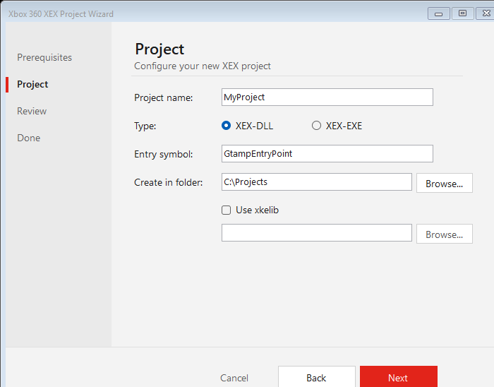

# XexForge

**Scaffold and build Xbox 360 `.xex` projects with CMake — via a one‑click wizard.**

XexForge generates self‑contained Xbox 360 projects that compile with the official
XDK tools (`cl` → `link` → `imagexex`) through CMake. A small Windows‑native wizard
(PowerShell + WinForms, no install required) walks you through creating a project;
the generated project then builds from any terminal.



> Windows‑only — the Xbox 360 XDK is Windows‑only.

## Features

- **GUI wizard** — pick a name, XEX‑DLL or XEX‑EXE, target folder, optional xkelib; it
  scaffolds a complete, buildable project.
- **Prerequisite gate** — detects the XDK, CMake, and a generator before you proceed;
  finds the **Visual Studio‑bundled Ninja** automatically (no `PATH` setup).
- **Real XDK pipeline** — a CMake toolchain + an `add_xex()` helper drive `cl`/`link`/
  `imagexex`, producing a proper rebased, compressed `.xex` that loads on hardware.
- **Self‑contained output** — each generated project carries its own `cmake/` core and a
  `CMakePresets.json` with the Ninja path baked in, so `cmake --preset xdk` builds from
  any terminal.
- **Optional xkelib** — wired by path only, never bundled.

## Requirements

- **Xbox 360 XDK** installed (the `XEDK` environment variable, or the default
  `C:\Program Files (x86)\Microsoft Xbox 360 SDK`).
- **CMake ≥ 3.21** on `PATH`.
- A generator: **Ninja** (the wizard auto‑detects the VS‑bundled one), or **NMake**
  (run from a VS/XDK developer prompt).

## Quick start

1. Double‑click `Wizard\Launch-Wizard.bat`.
2. Confirm the prerequisites are green.
3. Enter a name, pick **XEX‑DLL** or **XEX‑EXE**, choose a folder, optionally point at xkelib.
4. Click **Create**, then **Configure + Build**.

The `.xex` lands in `build\<ProjectName>.xex`.

## Building a generated project (no wizard)

```sh
cd MyProject
cmake --preset xdk
cmake --build build
```

> **Portable builds:** generated projects embed the full Ninja path as
> `CMAKE_MAKE_PROGRAM` in `CMakePresets.json`, so this works from plain `cmd.exe` or a
> minimal PowerShell session — Ninja does not need to be on `PATH`.

## What gets generated

A self‑contained project (carries its own `cmake\` core):

```
MyProject/
  cmake/              XdkXenon.toolchain.cmake, XdkXex.cmake
  CMakeLists.txt
  CMakePresets.json
  Application.xml     XEX image config (imagexex)
  src/                main.cpp (+ entry.cpp for XEX‑DLL)
```

## How it works

| Piece | Role |
|-------|------|
| `cmake/XdkXenon.toolchain.cmake` | Points CMake at the XDK `cl`/`link`/`lib`; sets the proven Xenon compile/link flags. |
| `cmake/XdkXex.cmake` (`add_xex()`) | Builds the PE (`/XEX:NO` + `/FIXED:NO` so imagexex can rebase it), links the base Xbox libs, and packages the `.xex` via `imagexex`. |
| `Wizard/XexProjectWizard.ps1` | The WinForms wizard (a thin UI over `XexScaffold.psm1`). |
| `Wizard/XexScaffold.psm1` | Detection + template rendering + the `New-XexProject` scaffolder. |

## xkelib

[xkelib](https://github.com/) is an external dependency and is **never bundled**. When
enabled, the generated project adds its folder to the include + library paths; xkelib's
own `#pragma comment(lib, ...)` then auto‑link `kernelext`/`xamext`/`xav`.

## Repo layout (the toolkit itself)

```
Wizard/     the wizard + scaffolder module + launcher
cmake/      the toolchain + add_xex helper (copied into every generated project)
template/   the *.in project templates the wizard fills
Tests/      zero-dependency PowerShell test harness
```

## Tests

```sh
powershell -ExecutionPolicy Bypass -File Tests\Run-Tests.ps1
```

## License

[MIT](LICENSE)
